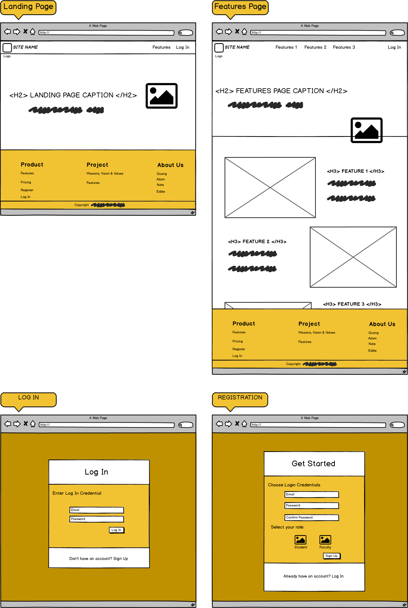
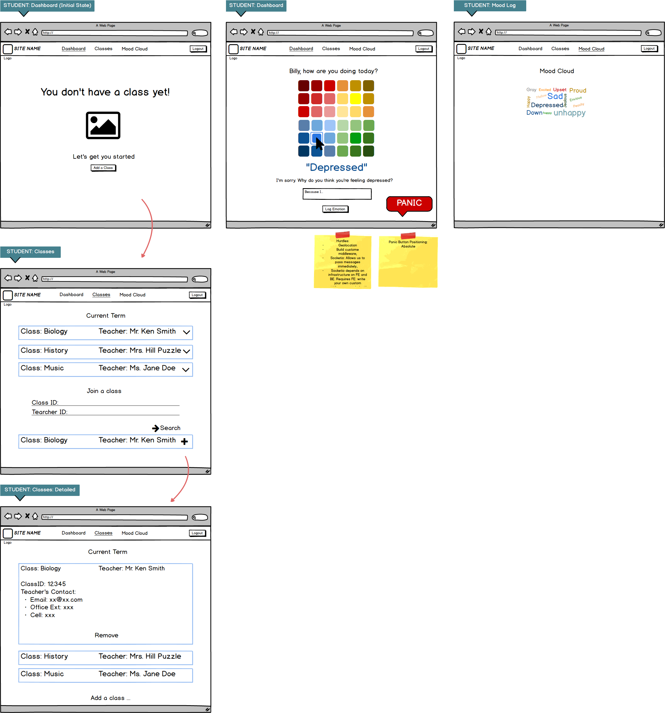
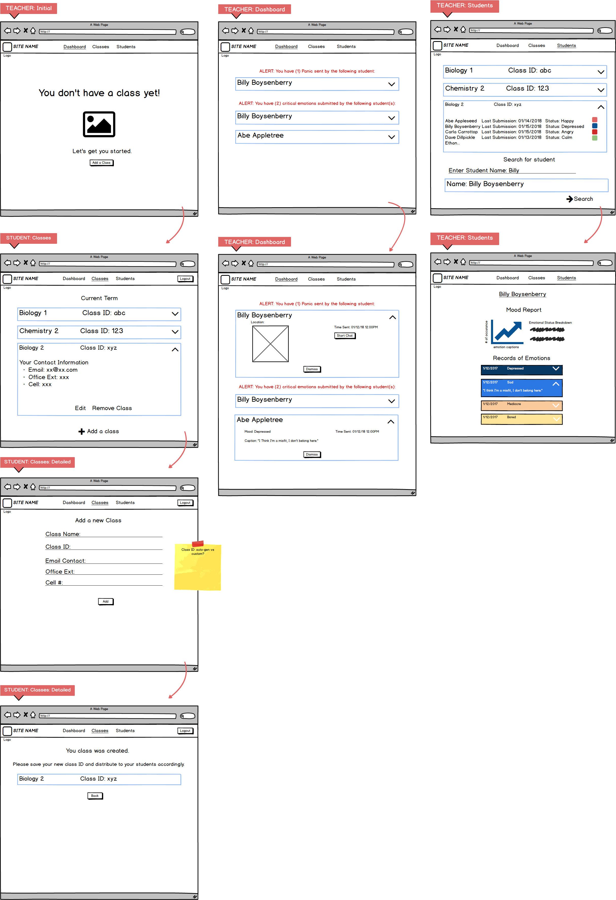
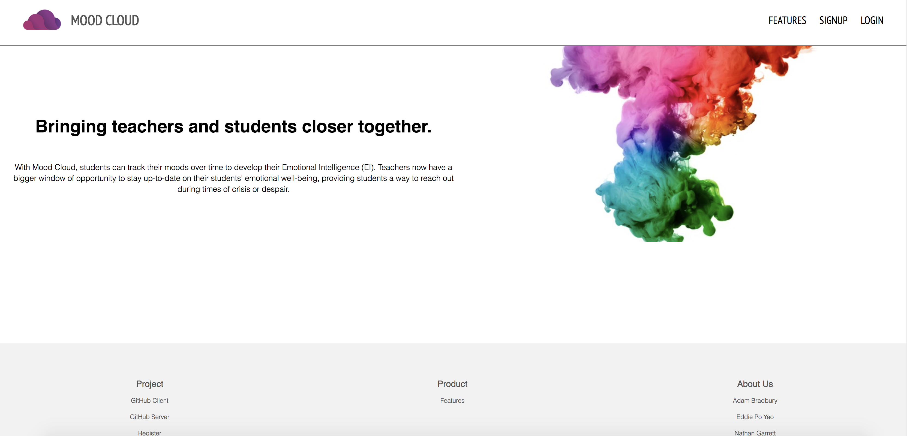
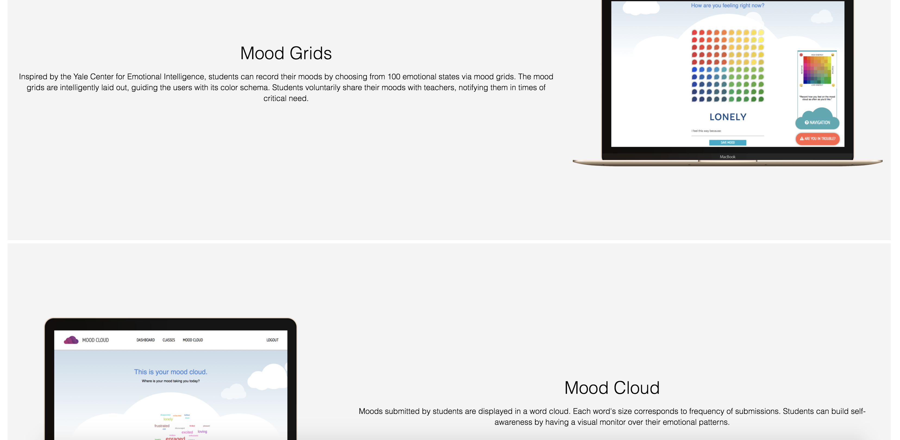
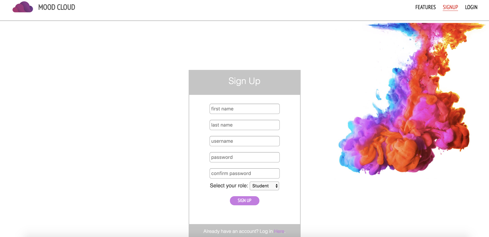
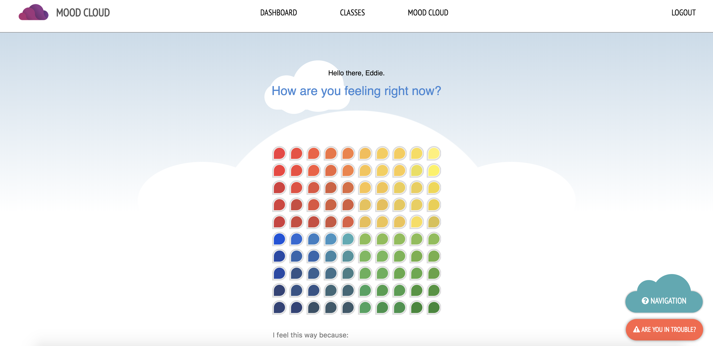
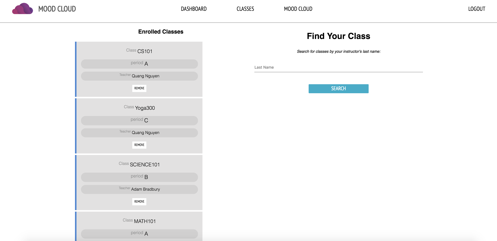
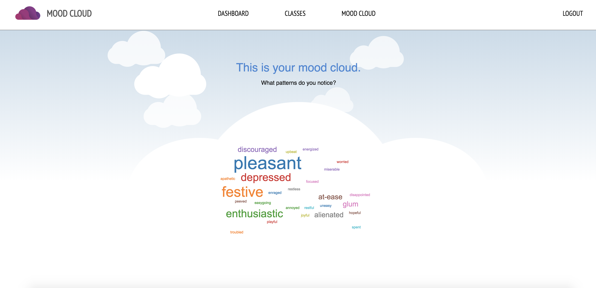
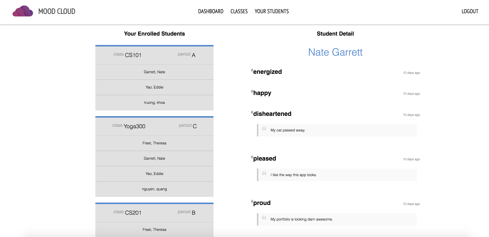

# <a href="http://mood-cloud.netlify.com/">Mood Cloud</a>

## ABOUT THIS PROJECT
The purpose of the Mood Cloud project is to provide teachers and students a way to enhance their emotional intelligence, commonly referred to as EI or EQ, and better connect interpersonally. Often, many students struggle to express or track their emotional state, making it difficult for teachers to adequately gauge their emotional well-being. Mood Cloud provides a means for students to track their moods overtime, and observe them reflected in a word cloud. Students may also log comments about their emotional state for later reference, helping to gain further insight into their ongoing emotional well-being. Students may also share their moods with their teachers and alert them during times of crisis or despair. Connected teachers receive up-to-date alerts from students who submit critical moods, or alert their teacher directly via a panic/alert button. Additionally, teachers or students may open an instant message alert window to respond to any dire student needs.

## Demo Student Account
User: demo_student1
Pass: password

## Demo Teacher Account
User: demo_teacher1
Pass: password

## KEY USER FEATURES
AS a ***TEACHER/COUNSELOR***, you will be able to:
* Create new class with auto-generated class ID, which allows students to add their class and        share their moods.
* Edit & delete existing class information.
* Be alerted when a student presses the panic button, which opens an instant message window for      real-time communication between the student and teacher/teachers.
* Stay up-to-date when a students submit moods that are of concern (i.e. depressed, enraged).
* View all students who've provided access their personal mood profile with a mood history that      logs their emotion submissions.

AS a ***STUDENT***, you will be able to:
* Search and add one or multiple classes by searching for a teacher's name.
* Remove yourself from a class at any time.
* Submit your emotional status, which then displays on a Mood Cloud.
* Provide an optional description on every mood submitted to journal their emotional state over      time.
* Access to an alert button, which will alert all linked teacher
* Access to a crisis real-time instant messenger to open chat sessions with all linked teachers.

## WIREFRAME

## Live Site Screenshots

## TECHNOLOGY STACK

### FRONT-END TECHNOLOGIES:
* JavaScript
* CSS
* HTML
* React/Redux/Redux Form
* Socket.io

### SERVER TECHNOLOGIES:
* Node JS
* Express
* Passport: Local and JWT authentication

## DATA PERSISTENCE:
* MongoDB
* D3

## CICD
* Mocha/Chai
* Jest

## ATTRIBUTIONS
* Create-React-App by Facebook - 2018
* Mood Meter by Yale Center for Emotional Intelligence.

## Collaborators
<a href="https://github.com/adpoyao">@adpoyao</a>, <a href="https://github.com/nateusmc">@nateusmc</a>, <a href="https://github.com/F-Adam-B">@F-Adam-B</a>, <a href="https://github.com/inconbeo">@inconbeo</a>
